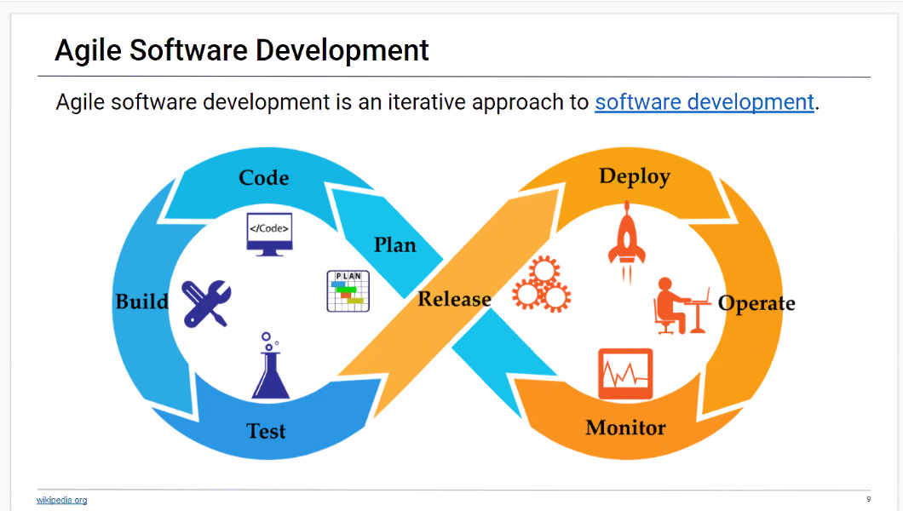

  # README Generator
  

  ## Description
  * Links for screencastify video [screencastify](https://drive.google.com/file/d/11IPafuyeziyxnMC5_dBVT5fiOD6W2cJX/view)  
  * Links for screencastify mp4 if original is blurry [mp4](https://drive.google.com/file/d/1zRCeHBg6zIN1tCKsc-AHoaOQRPai2Afp/view?usp=sharing)  
  Generates a README file that is professional and consistent for your GIT repo and/or other applications

  ## Table of Contents
  * [Installation](##Installation)
  * [Usage](##Usage)
  * [License](##License)
  * [Languages](##Languages)  
  
  
  * [Questions](##Questions) 
  

  ## Installation
  This application requires the install on Node and NPM package inquirer

  ## Usage
  Once system requirements are installed initiate the application through commandline interface node index 

    
  
  ## Languages  
        
 

  ## License
  
  
  This application currently is licensed with [MIT](./license/MIT.txt). 
  Please click on the [link](./license/MIT.txt) to review all terms, definitions and conditions of use.

  

  ## Contribute
  Contributer privlages are open to ALL that want to positively contribute to this project

  
  

  ## Questions
  Please feel free to email me with any comments, questions or concerns at ap@ampiUSA.com

  [GitHub Account](https://github.com/a7063p)

